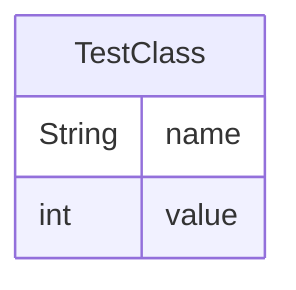

# test_doc Documentation Summary

## Overview

The test_doc module is a simple Java-based system that demonstrates basic object-oriented programming concepts. It primarily consists of a single class, TestClass, which encapsulates data and provides methods for data manipulation and retrieval. This module serves as a foundational example for creating and working with objects in Java.

## Key Components

1. **TestClass**: A Java class that represents an object with a name (String) and a value (int). It includes:
   - Constructor: Initializes the object with a name and value
   - Getter methods: Retrieve the name and value
   - processData method: Prints the object's information to the console

## Functional Areas

### 1. Object Creation and Initialization
The TestClass constructor allows for the creation of objects with specific names and values, demonstrating basic object instantiation in Java.

### 2. Data Encapsulation and Retrieval
The class encapsulates its data (name and value) and provides getter methods for controlled access to these properties, showcasing the principle of data encapsulation.

### 3. Data Processing
The processData method demonstrates a simple data processing operation by outputting the object's information to the console.

### Entity Relationship Diagram

## Dependencies

The TestClass relies solely on the Java standard library:

1. java.lang.String: Used for storing and manipulating the object's name.
2. java.lang.System: Used in the processData method to access the standard output stream for console printing.

No external libraries or frameworks are required, making this a self-contained example of basic Java programming concepts.