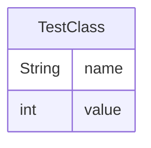

# TestClass.java

## Package `unknown`

## Functional Overview

The `TestClass` is a simple Java class that represents an object with a name and a value. It provides basic functionality to create, retrieve, and process data associated with the object. The class is designed to encapsulate two pieces of information: a string name and an integer value. It offers methods to access these properties and perform a basic processing operation that prints the object's information to the console.

## Data Structures

### TestClass

| Field  | Type   | Purpose                                     |
|--------|--------|---------------------------------------------|
| name   | String | Stores the name associated with the object  |
| value  | int    | Stores the numeric value of the object      |

### Input/Output Data

#### Input Data

| Field  | Type   | Purpose                                     |
|--------|--------|---------------------------------------------|
| name   | String | Input parameter for the object's name       |
| value  | int    | Input parameter for the object's value      |

#### Output Data

| Method      | Return Type | Purpose                                     |
|-------------|-------------|---------------------------------------------|
| getName()   | String      | Returns the name of the object              |
| getValue()  | int         | Returns the value of the object             |

### Entity Relationship Diagram



## Program Flow

### Control Flow Diagram

```mermaid
graph TD
    A[Start] --> B[Create TestClass object]
    B --> C{Process data?}
    C -->|Yes| D[Call processData()]
    C -->|No| E[Access name/value]
    E --> F[Call getName()]
    E --> G[Call getValue()]
    D --> H[End]
    F --> H
    G --> H
```

### Functions and Procedures

1. **Constructor: TestClass(String name, int value)**
   - Purpose: Initializes a new TestClass object with the given name and value.
   - Parameters:
     - name: String - The name to be associated with the object.
     - value: int - The numeric value to be associated with the object.

2. **getName()**
   - Purpose: Retrieves the name of the TestClass object.
   - Returns: String - The name of the object.
   - Parameters: None

3. **getValue()**
   - Purpose: Retrieves the value of the TestClass object.
   - Returns: int - The numeric value of the object.
   - Parameters: None

4. **processData()**
   - Purpose: Processes the data of the TestClass object by printing its name and value to the console.
   - Returns: void
   - Parameters: None

## External Dependencies

The TestClass does not have any external dependencies beyond the Java standard library. It uses the following built-in Java classes:

1. **java.lang.String**
   - Purpose: Used to store and manipulate the name of the TestClass object.

2. **java.lang.System**
   - Purpose: Used in the processData() method to access the standard output stream (System.out) for printing information to the console.

No additional libraries or frameworks are required for this class to function.